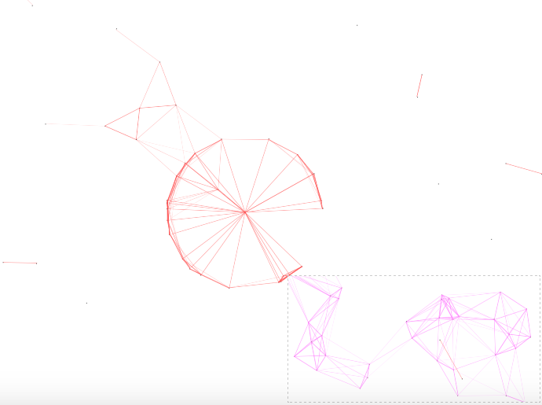

# cavas-nest.js
A nest backgroud of website draw on cavas.

## feature

 - do not depend on jQuery or other javascript framework.
 - very light, only 1.59kb. can be smaller after gzip.
 - so easy to use, even you are not a web developer.

## usage

so eazy that I do not want write the chapter.

    

then ok!

## preview 

1. [OnlineTool: http://www.atool.org/](http://www.atool.org/)

if you has used this project, pls let me know, I can add your website on.

## other

 - the code is from other website, is not writed by myself. I just do some code on it.
 - I search the github, but can not find the code.
 - if the code is piracy of yours, pls let me know.

